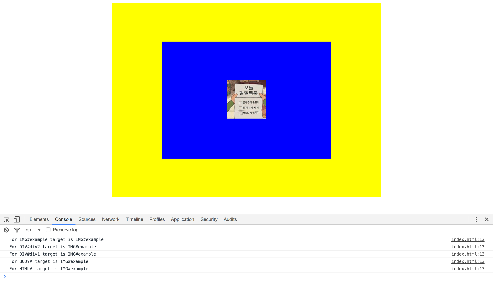
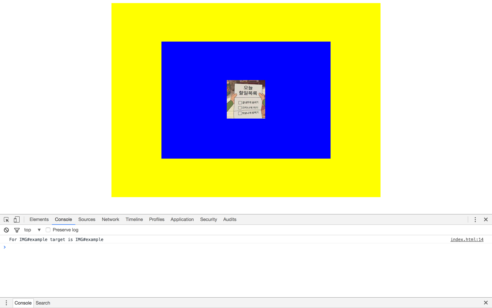

# 1. 이벤트 버블링이란?
html에서 해당 엘리먼트가 이벤트가 발생이 되었을때, 해당 요소로 시작해 상위 요소가 차례로 이벤트를 처리하는 방식 ~~반대는 캡처링~~ 
 
Document에서 시작해 html body ...으로 내려가는 것을 캡처링이라고 한다.
이벤트를 발생시킨 DOM 객체를 타겟 객체라 하며, 타겟 객체에 이벤트를 발생시킨 이후 이벤트가 타겟 객체(현재의 <td>)의 부모로 전달되고 또 그 부모의 부모객체를 이어가며 다시 최상위 Document까지 이벤트가 전달되는 것이 버블링(bubbling)이다.
***
버블링을 알아보기 위해 자바스크립트 코드와 html코드를 작성  

    <!DOCTYPE html>
    <html>

    <head>
        <meta charset="utf-8">
        <title></title>
        
        
        
    </head>

    <body>
        

            

                
            

        

    </body>

    </html>

***

 
console에서 보이는 결과와 같이 클릭 이벤트가 발생한 지점에서 시작하여 부모 객체로 점점씩 올라가는 결과가 나온다. 이것이 버블링! 
버블링의 단점이 있는데 이렇게 위로 올라가다보니까 부모 객체에서도 그 이벤트가 실행이되어서 같이 돌아간다. 
그래서  jQuery에서는 이를 방지하는 메소드를 제공한다. 
.stopPropagation()이라는 코드이다.

    

***
실행결과

이미지를 클릭 했을때 이미지만 이벤트가 발생하고,
부모객체는 더이상 영향이 받지않는다.
